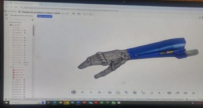
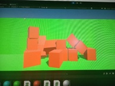

# Protesis-inteligente
Es un proyecto bastante complejo ya que tiene que ver muchas tecnologías para poder hacerlo realidad, entre ellas entrenar una inteligencia artificial y trabajar en un feedback para retroalimentacion de la misma protesis

  

  

---

🧰 Tecnologías Utilizadas

- Python
- Tensorflow
- Arduino
- Unity
- OpenCV
- matlab
